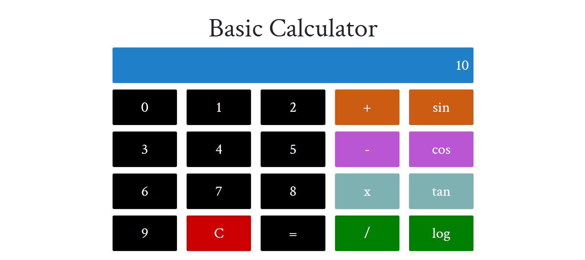

# Simple-JavaScript-Calculator

A simple JavaScript Calculator.

## How to run

- Run the following commands on terminal / shell / cmd

```shell
git clone https://github.com/NayanBramhane/um-simple-javascript-calculator.git
cd um-simple-javascript-calculator
```

- Now open the folder 'um-simple-javascript-calculator' in file manager.
- Now open the 'index.html' file by double clicking on it, or drag and drop it in open browser window.

## Summary

- It has addition, subtraction, division, multiplication.
- It has trignometric functions.


